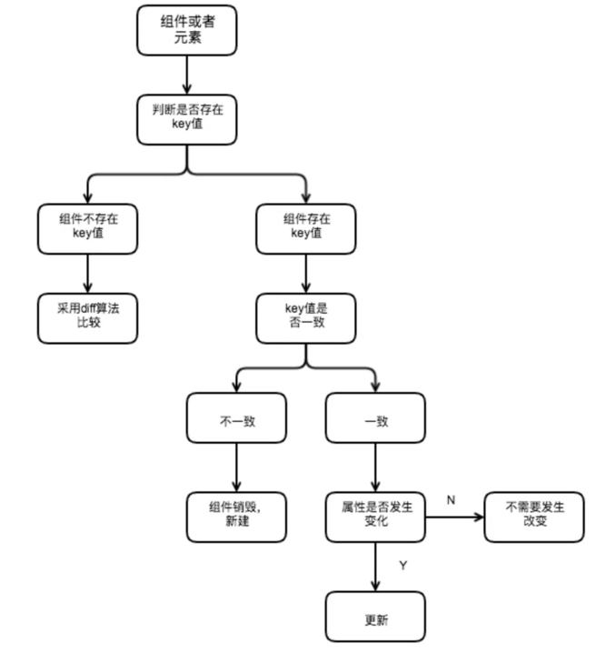

<font style="font-size: 36px;">React的key的作用</font>

## 一、是什么
首先，先给出react组件中进行列表渲染的一个示例：
```js
const data = [
  { id: 0, name: 'abc' },
  { id: 1, name: 'def' },
  { id: 2, name: 'ghi' },
  { id: 3, name: 'jkl' }
];

const ListItem = (props) => {
  return <li>{props.name}</li>;
};

const List = () => {
  return (
    <ul>
      {data.map((item) => (
        <ListItem name={item.name}></ListItem>
      ))}
    </ul>
  );
};
```
然后在输出就可以看到react所提示的警告信息：
```js
Each child in a list should have a unique "key" prop.
```
根据意思就可以得到渲染列表的每一个子元素都应该需要一个唯一的key值

在这里可以使用列表的id属性作为key值以解决上面这个警告
```js
const List = () => {
  return (
    <ul>
      {data.map((item) => (
        <ListItem name={item.name} key={item.id}></ListItem>
      ))}
    </ul>
  );
};
```
## 二、作用
跟Vue一样，React 也存在 Diff算法，而元素key属性的作用是用于判断元素是新创建的还是被移动的元素，从而减少不必要的元素渲染

因此key的值需要为每一个元素赋予一个确定的标识

如果列表数据渲染中，在数据后面插入一条数据，key作用并不大，如下：
```js
this.state = {
    numbers:[111,222,333]
}

insertMovie() {
  const newMovies = [...this.state.numbers, 444];
  this.setState({
    movies: newMovies
  })
}

<ul>
    {
        this.state.movies.map((item, index) => {
            return <li>{item}</li>
        })
    }
</ul>
```
前面的元素在diff算法中，前面的元素由于是完全相同的，并不会产生删除创建操作，在最后一个比较的时候，则需要插入到新的DOM树中

因此，在这种情况下，元素有无key属性意义并不大

下面再来看看在前面插入数据时，使用key与不使用key的区别：
```js
insertMovie() {
  const newMovies = [000 ,...this.state.numbers];
  this.setState({
    movies: newMovies
  })
}
```
当拥有key的时候，react根据key属性匹配原有树上的子元素以及最新树上的子元素，像上述情况只需要将000元素插入到最前面位置

当没有key的时候，所有的li标签都需要进行修改

同样，并不是拥有key值代表性能越高，如果说只是文本内容改变了，不写key反而性能和效率更高

主要是因为不写key是将所有的文本内容替换一下，节点不会发生变化

而写key则涉及到了节点的增和删，发现旧key不存在了，则将其删除，新key在之前没有，则插入，这就增加性能的开销

## 三、总结
良好使用key属性是性能优化的非常关键的一步，注意事项为：

- key 应该是唯一的
- key不要使用随机值（随机数在下一次 render 时，会重新生成一个数字）
- 使用 index 作为 key值，对性能没有优化

react判断key的流程具体如下图：



## 参考文献
- https://zh-hans.reactjs.org/docs/lists-and-keys.html#gatsby-focus-wrapper
- https://segmentfault.com/a/1190000017511836