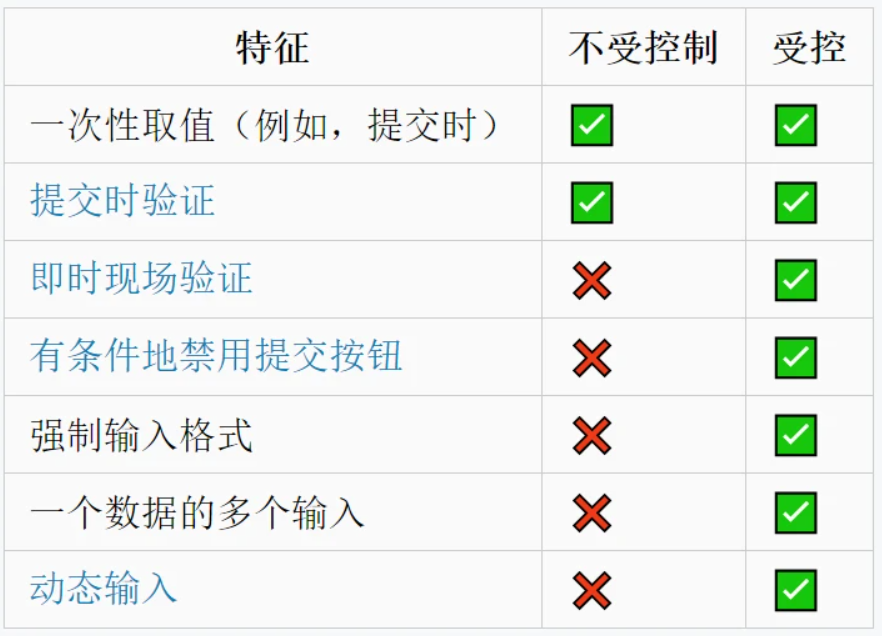

<font style="font-size: 36px;">React受控组件和非受控组件的理解</font>

## 一、受控组件
受控组件，简单来讲，就是受我们控制的组件，组件的状态全程响应外部数据

举个简单的例子：
```js
class TestComponent extends React.Component {
  constructor (props) {
    super(props);
    this.state = { username: 'lindaidai' };
  }
  render () {
    return <input name="username" value={this.state.username} />
  }
}
```
这时候当我们在输入框输入内容的时候，会发现输入的内容并无法显示出来，也就是input标签是一个可读的状态

这是因为value被this.state.username所控制住。当用户输入新的内容时，this.state.username并不会自动更新，这样的话input内的内容也就不会变了

如果想要解除被控制，可以为input标签设置onChange事件，输入的时候触发事件函数，在函数内部实现state的更新，从而导致input框的内容页发现改变

因此，受控组件我们一般需要初始状态和一个状态更新事件函数

## 二、非受控组件
非受控组件，简单来讲，就是不受我们控制的组件

一般情况是在初始化的时候接受外部数据，然后自己在内部存储其自身状态

当需要时，可以使用ref 查询 DOM并查找其当前值，如下：
```js
import React, { Component } from 'react';

export class UnControll extends Component {
  constructor (props) {
    super(props);
    this.inputRef = React.createRef();
  }
  handleSubmit = (e) => {
    console.log('我们可以获得input内的值为', this.inputRef.current.value);
    e.preventDefault();
  }
  render () {
    return (
      <form onSubmit={e => this.handleSubmit(e)}>
        <input defaultValue="lindaidai" ref={this.inputRef} />
        <input type="submit" value="提交" />
      </form>
    )
  }
}
```
关于refs的详情使用可以参考之前[文章](https://aigouzz.github.io/dist/react/12.html)

## 三、应用场景
大部分时候推荐使用受控组件来实现表单，因为在受控组件中，表单数据由React组件负责处理

如果选择非受控组件的话，控制能力较弱，表单数据就由DOM本身处理，但更加方便快捷，代码量少

针对两者的区别，其应用场景如下图所示：



## 参考文献
- http://meloguo.com/2018/10/08/受控与非受控组件/
- https://zhuanlan.zhihu.com/p/37579677