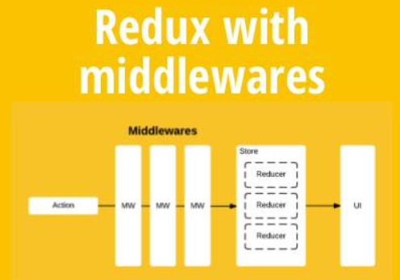

<font style="font-size: 36px;">Redux中间件的理解及常用的中间件</font>

## 一、是什么
中间件（Middleware）是介于应用系统和系统软件之间的一类软件，它使用系统软件所提供的基础服务（功能），衔接网络上应用系统的各个部分或不同的应用，能够达到资源共享、功能共享的目的

在上篇文章中，了解到了Redux整个工作流程，当action发出之后，reducer立即算出state，整个过程是一个同步的操作

那么如果需要支持异步操作，或者支持错误处理、日志监控，这个过程就可以用上中间件

Redux中，中间件就是放在就是在dispatch过程，在分发action进行拦截处理，如下图：



其本质上一个函数，对store.dispatch方法进行了改造，在发出 Action和执行 Reducer这两步之间，添加了其他功能

## 二、常用的中间件
有很多优秀的redux中间件，如：

- redux-thunk：用于异步操作
- redux-logger：用于日志记录

上述的中间件都需要通过applyMiddlewares进行注册，作用是将所有的中间件组成一个数组，依次执行

然后作为第二个参数传入到createStore中
```js
const store = createStore(
  reducer,
  applyMiddleware(thunk, logger)
);
```
### redux-thunk
redux-thunk是官网推荐的异步处理中间件

- 默认情况下的dispatch(action)，action需要是一个JavaScript的对象
- redux-thunk中间件会判断你当前传进来的数据类型，如果是一个函数，将会给函数传入参数值（dispatch，getState）
- dispatch函数用于我们之后再次派发action
- getState函数考虑到我们之后的一些操作需要依赖原来的状态，用于让我们可以获取之前的一些状态

所以dispatch可以写成下述函数的形式：
```js
const getHomeMultidataAction = () => {
  return (dispatch) => {
    axios.get("http://xxx.xx.xx.xx/test").then(res => {
      const data = res.data.data;
      dispatch(changeBannersAction(data.banner.list));
      dispatch(changeRecommendsAction(data.recommend.list));
    })
  }
}
```
### redux-logger
如果想要实现一个日志功能，则可以使用现成的redux-logger

```js
import { applyMiddleware, createStore } from 'redux';
import createLogger from 'redux-logger';
const logger = createLogger();

const store = createStore(
  reducer,
  applyMiddleware(logger)
);
```
这样我们就能简单通过中间件函数实现日志记录的信息

## 三、实现原理
首先看看applyMiddlewares的源码
```js
export default function applyMiddleware(...middlewares) {
  return (createStore) => (reducer, preloadedState, enhancer) => {
    var store = createStore(reducer, preloadedState, enhancer);
    var dispatch = store.dispatch;
    var chain = [];

    var middlewareAPI = {
      getState: store.getState,
      dispatch: (action) => dispatch(action)
    };
    chain = middlewares.map(middleware => middleware(middlewareAPI));
    dispatch = compose(...chain)(store.dispatch);

    return {...store, dispatch}
  }
}
```
所有中间件被放进了一个数组chain，然后嵌套执行，最后执行store.dispatch。可以看到，中间件内部（middlewareAPI）可以拿到getState和dispatch这两个方法

在上面的学习中，我们了解到了redux-thunk的基本使用

内部会将dispatch进行一个判断，然后执行对应操作，原理如下：
```js
function patchThunk(store) {
    let next = store.dispatch;

    function dispatchAndThunk(action) {
        if (typeof action === "function") {
            action(store.dispatch, store.getState);
        } else {
            next(action);
        }
    }

    store.dispatch = dispatchAndThunk;
}
```
实现一个日志输出的原理也非常简单，如下：
```js
let next = store.dispatch;

function dispatchAndLog(action) {
  console.log("dispatching:", addAction(10));
  next(addAction(5));
  console.log("新的state:", store.getState());
}

store.dispatch = dispatchAndLog;
```
## 参考文献
- http://www.ruanyifeng.com/blog/2016/09/redux_tutorial_part_two_async_operations.html