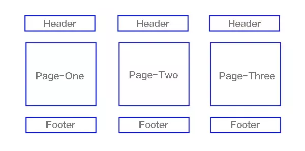

## 一、什么是SPA
SPA（single-page application），翻译过来就是单页应用SPA是一种网络应用程序或网站的模型，它通过动态重写当前页面来与用户交互，这种方法避免了页面之间切换打断用户体验在单页应用中，所有必要的代码（HTML、JavaScript和CSS）都通过单个页面的加载而检索，或者根据需要（通常是为响应用户操作）动态装载适当的资源并添加到页面页面在任何时间点都不会重新加载，也不会将控制转移到其他页面举个例子来讲就是一个杯子，早上装的牛奶，中午装的是开水，晚上装的是茶，我们发现，变的始终是杯子里的内容，而杯子始终是那个杯子结构如下图

我们熟知的JS框架如react,vue,angular,ember都属于SPA

## 二、SPA和MPA的区别
上面大家已经对单页面有所了解了，下面来讲讲多页应用MPA（MultiPage-page application），翻译过来就是多页应用在MPA中，每个页面都是一个主页面，都是独立的当我们在访问另一个页面的时候，都需要重新加载html、css、js文件，公共文件则根据需求按需加载如下图

#### 单页应用与多页应用的区别
单页面应用（SPA）	多页面应用（MPA）
组成	一个主页面和多个页面片段	多个主页面
刷新方式	局部刷新	整页刷新
url模式	哈希模式	历史模式
SEO搜索引擎优化	难实现，可使用SSR方式改善	容易实现
数据传递	容易	通过url、cookie、localStorage等传递
页面切换	速度快，用户体验良好	切换加载资源，速度慢，用户体验差
维护成本	相对容易	相对复杂
